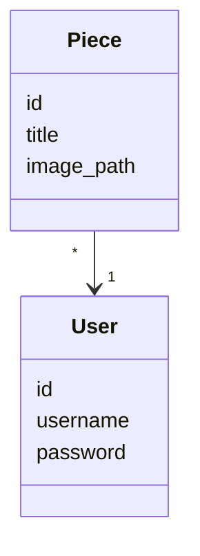
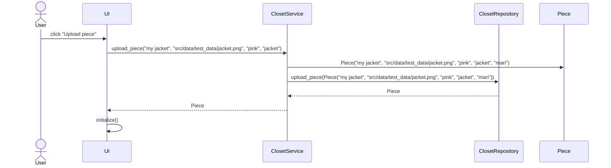
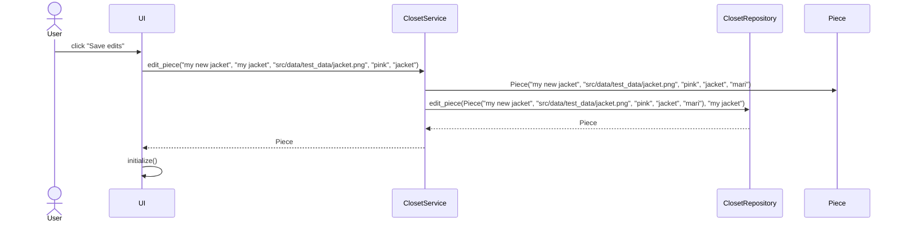

# Arkkitehtuurikuvaus
## Ohjelman rakenne
Ohjelman rakenne noudattelee kolmitasoista kerrosarkkitehtuuria, joka näkyy seuraavasta pakkauskaaviosta:

Pakkaus ui vastaa käyttöliittymästä, services sovelluslogiikasta ja repositories tietojen tallenuksesta. Entities vastaa sovelluksen käyttämistä tietokohteista.

## Käyttöliittymä
Käyttöliittymä koostuu näkymistä:
- kirjautuminen
- uuden käyttäjän luominen
- pääkymä
- uuden vaatekappaleen lisääminen

Jokainen näkymä on toteutettu omana luokkanaan ja näkymistä vain yksi kerrallaan on näkyvänä. Näkymien näyttämisestä vasta UI-luokka. Käyttöliittymä on pääosin eristetty sovelluslogiikasta ja se kutsuu ClosetService-luokan metodeja. 

Kun vaatekappaleita lisätään tai kun niiden järjestystä lajitellaan, sovelluksen _show_uploaded_pieces metodi päivittää päänäkymän. 

## Sovelluslogiikka

Sovelluksen loogisen tietomallin muodostavat luokat User ja Piece, jotka kuvaavat käyttäjiä ja käyttäjien vaatekappaleita:

Toiminnallisista kokonaisuuksista vastaa ClosetService. Luokassa on käyttäliittymän toiminnoille omat metodit, esimerkiksi:

- `login(username, password)`
- `upload_piece(title, image_path)`
- `show_image()`

_ClosetService_ pääsee käsiksi käyttäjiin ja kappaleisiin(pieces) tietojen tallennuksesta vastaavan pakkauksessa _repositories_ sijaitsevien luokkien ClosetRepository ja UserRepository kautta.

ClosetService-luokan ja ohjelman muiden osien suhdetta kuvaava luokka/pakkauskaavio:

## Tietojen tallennus

Pakkauksen repositories luokat ClosetRepository ja UserRepository vastaavat tietojen tallentamisesta. Molemmat luokat tallentavat tietoa SQlite-tietokantaan. Käyttäjät tallennetaan SQlite-tietokannan tauluun users ja vaatekappaleet tallennetaan SQlite-tietokannan tauluun pieces. Molemmat taulut alustetaan initialize_database.py-tiedostossa. 

## Päätoiminnallisuudet

- Käyttäjän kirjautuminen
- Käyttäjän rekisteröityminen
- Uuden vaatekappaleen lisääminen
- Vaatekappaleen muokkaaminen

## Sekvenssikaavio uuden vaatekappaleen (Piece) lisäämisestä

Uuden Piecen lisäävän upload_view:n "Upload piece"-painikkeen klikkaamisen jälkeen sovelluksen kontrolli etenee seuraavasti:

Tapahtumakäsittelijä kutsuu sovellusluokan metodia upload_piece antaen parametriksi vaatteen nimen, kuvan polun, vaatteen värin, vaatteen kategorian ja käyttäjänimen. Sovelluslogiikka luo uuden Piece-olion ja tallettaa sen kutsumalla ClosetRepository:n metodia upload_piece. Tästä seurauksena käyttöliittymä main_view päivittää näytettävät tiedot.

## Sekvenssikaavio vaatekappaleen (Piece) muokkaamisesta

Jo ladatun Piecen muokkaamista käsittelevän edit_view:n "Save edits"-painikkeen klikkaamisen jälkeen sovelluksen kontrolli etenee seuraavasti:

Tapahtumakäsittelijä kutsuu sovellusluokan metodia edit_piece antaen parametriksi vaatteen nimen, vanhan nimen, kuvan polun, vaatteen värin, vaatteen kategorian ja käyttäjänimen. Sovelluslogiikka luo uuden Piece-olion ja tallettaa sen kutsumalla ClosetRepository:n metodia edit_piece. Tietokantaan päivittyy aiemmin tallennettuun kappaleeseen uudet tiedot. Tästä seurauksena käyttöliittymä main_view päivittää näytettävät tiedot.

## Muut toiminnallisuudet

Myös käyttäjien kirjautuminen ja rekisteröityminen toimivat samalla kaavalla, jossa käyttöliittymän tapahtumakäsittelijä kutsuu sovellusluokan metodia, ja sovelluslogiikka kutsuu sopivan repositorion metodia. Kun palataan käyttöliittymään, aktiivinen näkymä ja ladatut vaattekappaleet päivitetään.
