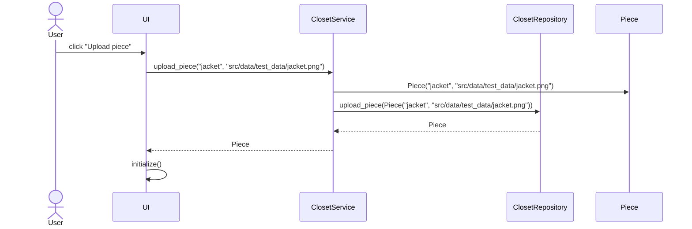

# Arkkitehtuurikuvaus
## Ohjelman alustava rakenne luokka- ja pakkauskaavioina

Sovelluksen loogisen tietomallin muodostavat luokat User ja Piece, jotka kuvaavat käyttäjiä ja käyttäjien vaatekappaleita:

Toiminnallisista kokonaisuuksista vastaa ClosetService. Luokassa on käyttäliittymän toiminnoille omat metodit, esimerkiksi:

- `login(username, password)`
- `upload_piece(title, image_path)`
- `show_image()`

_ClosetService_ pääsee käsiksi käyttäjiin ja kappaleisiin(pieces) tietojen tallennuksesta vastaavan pakkauksessa _repositories_ sijaitsevien luokkien ClosetRepository ja UserRepository kautta.

ClosetService-luokan ja ohjelman muiden osien suhdetta kuvaava luokka/pakkauskaavio:

## Sekvenssikaavio uuden vaatekappaleen (Piece) lisäämisestä

Uuden Piecen lisäävän upload_view:n "Upload piece"-painikkeen klikkaamisen jälkeen sovelluksen kontrolli etenee seuraavasti:

Tapahtumakäsittelijä kutsuu sovellusluokan metodia upload_piece antaen parametriksi vaatteen nimen ja kuvan polun. Sovelluslogiikka luo uuden Piece-olion ja tallettaa sen kutsumalla ClosetRepository:n metodia upload_piece. Tästä seurauksena käyttöliittymä main_view päivittää näytettävät tiedot.
