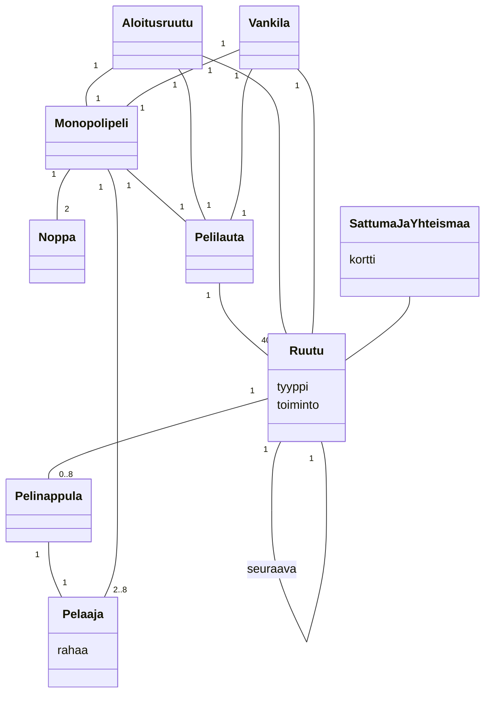

```mermaid
 classDiagram
    Monopolipeli "1" -- "2" Noppa
    Monopolipeli "1" -- "1" Pelilauta
    Pelilauta "1" -- "40" Ruutu
    Ruutu "1" -- "1" Ruutu : seuraava
    Ruutu "1" -- "0..8" Pelinappula
    class Ruutu{
        tyyppi
        toiminto
    }
    Aloitusruutu "1" -- Ruutu
    Aloitusruutu "1" -- "1" Pelilauta
    Aloitusruutu "1" -- "1" Monopolipeli
    Vankila "1" -- Ruutu
    Vankila "1" -- "1" Pelilauta
    Vankila "1" -- "1" Monopolipeli
    Sattuma Ja Yhteismaa -- Ruutu
    class Sattuma Ja Yhteismaa{
        kortti
    } 
    Pelinappula "1" -- "1" Pelaaja
    Pelaaja "2..8" -- "1" Monopolipeli
    class Pelaaja{
        rahaa
    }
```
