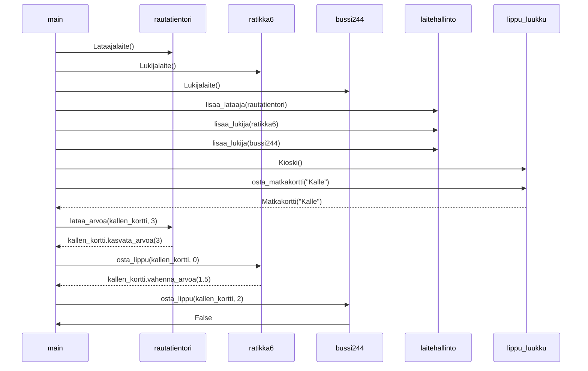

```mermaid
 sequenceDiagram
    main->>rautatientori: Lataajalaite()
    main->>ratikka6: Lukijalaite()
    main->>bussi244: Lukijalaite()
    main->>laitehallinto: lisaa_lataaja(rautatientori)
    main->>laitehallinto: lisaa_lukija(ratikka6)
    main->>laitehallinto: lisaa_lukija(bussi244)
    main->>lippu_luukku: Kioski()
    main->>lippu_luukku: osta_matkakortti("Kalle")
    lippu_luukku-->>main: Matkakortti("Kalle")
    main->>rautatientori: lataa_arvoa(kallen_kortti, 3)
    rautatientori-->>main: kallen_kortti.kasvata_arvoa(3)
    main->>ratikka6: osta_lippu(kallen_kortti, 0)
    ratikka6-->>main: kallen_kortti.vahenna_arvoa(1.5)
    main->>bussi244: osta_lippu(kallen_kortti, 2)
    bussi244->>main: False
```
